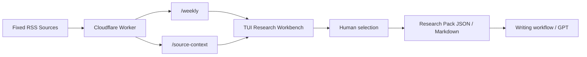

# Weekly Research Workbench

A lightweight market-research stack for weekly report workflows.

This repo contains two pieces:

1. A `Cloudflare Worker` that fetches fixed RSS sources, normalizes them, clusters them, and exposes stable JSON.
2. A `TUI-style workbench` that lets you inspect topics, open source context, pin stories, tag `core / related`, and export a research pack before writing.

The project is designed for a simple rule:

`fixed sources -> structured research -> human selection -> report writing`

It does **not** use general web search as a fallback, and it does **not** try to write weekly report copy inside the Worker itself.

## Architecture



## Workbench screenshot


## Repo structure

### `src/`

Cloudflare Worker source code.

- `index.ts`: routing and API responses
- `rss.ts`: RSS parsing and normalization
- `source-context.ts`: fetch and clean selected article pages
- `editorial.ts`: scoring and enrichment
- `signals.ts`: private enrichment adapters
- `sources.ts`: built-in RSS source registry
- `openapi.ts`: OpenAPI schema source

### `workbench/`

Static frontend research console.

- TUI-style layout
- local-only state via `localStorage`
- topic tabs: `bundles`, `clusters`, `raw`
- article selection and `core / related` tagging
- research export as JSON / Markdown

## What the Worker does

The Worker sits between fixed news feeds and downstream GPT/report workflows:

`RSS feeds -> Worker -> cleaned JSON -> workbench / GPT`

Core responsibilities:

- read only fixed RSS sources
- parse XML safely in Workers runtime
- clean HTML from descriptions
- deduplicate items by normalized URL
- preserve per-feed failure reporting
- cluster articles into themes
- expose a stable API for selection and downstream writing

The Worker intentionally does **not**:

- fall back to search engines
- scrape arbitrary websites as replacement sources
- write the final weekly report for you

## What the workbench does

The workbench is the manual selection layer on top of the Worker.

It is meant for:

- scanning candidate story bundles
- comparing cluster-level and raw fallback topics
- opening cleaned article context
- selecting the exact source set you want
- exporting a research pack before drafting

Current workbench features:

- load `/weekly`
- inspect `narrativeBundles`, `topicClusters`, and raw fallback topics
- sort by:
  - story
  - source quality
  - corroboration
  - market reaction
  - editorial score
- filter weak topics
- open `/source-context`
- mark articles as `core` or `related`
- pin topics
- add topic and article notes
- export selected research as JSON or Markdown
- adjustable 3-column layout with persistent widths

## API overview

### `GET /health`

Always public.

### `GET /sources`

Returns the built-in source registry.

If `API_KEY` is configured, callers must send:

```http
Authorization: Bearer <API_KEY>
```

### `GET /weekly`

Fetches recent items and returns:

- category article lists
- `topicClusters`
- `narrativeBundles`
- scoring fields such as:
  - `editorialScore`
  - `sourceQualityScore`
  - `corroborationScore`
  - `marketReactionScore`

Common query parameters:

- `days`
- `limitPerSource`
- `includeTaiwan`
- `categories`
- `keyword`
- `maxItemsPerCategory`

### `GET /source-context`

Fetches cleaned context for a selected article URL that already came from the feed layer.

Typical outputs include:

- `leadText`
- `articleExcerpt`
- `keyParagraphs`
- `quotedLines`
- `numbersMentioned`

## Current RSS sources

Default categories:

### `crypto`

- CoinDesk — `https://www.coindesk.com/arc/outboundfeeds/rss/?outputType=xml`
- Cointelegraph — `https://cointelegraph.com/rss`
- Decrypt — `https://decrypt.co/feed`
- The Defiant — `https://thedefiant.io/feed/`
- CFTC General Press Releases — `https://www.cftc.gov/RSS/RSSGP/rssgp.xml`

### `us_stocks_macro`

- Yahoo Finance — `https://finance.yahoo.com/news/rssindex`
- CNBC Markets — `https://www.cnbc.com/id/100003114/device/rss/rss.html`
- Federal Reserve — `https://www.federalreserve.gov/feeds/press_all.xml`
- Bank of England News — `https://www.bankofengland.co.uk/rss/news`
- Nasdaq AAPL — `https://www.nasdaq.com/feed/rssoutbound?symbol=AAPL`
- Nasdaq MSFT — `https://www.nasdaq.com/feed/rssoutbound?symbol=MSFT`
- Nasdaq GOOGL — `https://www.nasdaq.com/feed/rssoutbound?symbol=GOOGL`
- Nasdaq NVDA — `https://www.nasdaq.com/feed/rssoutbound?symbol=NVDA`
- Nasdaq INTC — `https://www.nasdaq.com/feed/rssoutbound?symbol=INTC`
- Nasdaq NOK — `https://www.nasdaq.com/feed/rssoutbound?symbol=NOK`

### `ai`

- MIT AI News — `https://news.mit.edu/topic/mitartificial-intelligence2-rss.xml`
- Hugging Face Blog — `https://huggingface.co/blog/feed.xml`
- VentureBeat AI — `https://venturebeat.com/category/ai/feed/`
- OpenAI News — `https://openai.com/news/rss.xml`
- Google AI Blog — `https://blog.google/technology/ai/rss/`
- Google DeepMind — `https://deepmind.google/blog/rss.xml`
- BAIR Blog — `https://bair.berkeley.edu/blog/feed.xml`

Optional category:

### `taiwan_stocks`

- FSC Press Releases — `https://www.fsc.gov.tw/RSS/Messages?serno=201202290016&language=english`
- TWSE News — `https://www.twse.com.tw/rwd/zh/news/feed?type=rss`
- CNA Finance — `https://feeds.feedburner.com/rsscna/finance`
- CNA Technology — `https://feeds.feedburner.com/rsscna/technology`
- MoneyDJ Finance News — `https://www.moneydj.com/kmdj/RssCenter.aspx?svc=NW&fno=1&arg=X0000000`
- DIGITIMES Daily — `https://www.digitimes.com/rss/daily.xml`
- TechNews Finance — `https://finance.technews.tw/feed/`
- Business Weekly Investment — `https://www.businessweekly.com.tw/Event/feedsec.aspx?feedid=10&channelid=15`
- MOPS Material Information 201001 — `https://mopsov.twse.com.tw/nas/rss/mopsrss201001.xml`
- MOPS Material Information 201002 — `https://mopsov.twse.com.tw/nas/rss/mopsrss201002.xml`
- MOPS Material Information 201003 — `https://mopsov.twse.com.tw/nas/rss/mopsrss201003.xml`
- Yahoo Taiwan Stock News — `https://tw.stock.yahoo.com/rss?category=tw-market`
- Yahoo Taiwan Stock News Feed — `https://tw.stock.yahoo.com/rss?category=news`
- Yahoo Taiwan Stock Research — `https://tw.stock.yahoo.com/rss?category=research`
- Yahoo Taiwan Funds News — `https://tw.stock.yahoo.com/rss?category=funds-news`
- Cnyes Taiwan Stock News (HTML feed parser) — `https://news.cnyes.com/news/cat/tw_stock_news`
- UDN Taiwan Stock News (HTML feed parser) — `https://money.udn.com/money/cate/5594`
- UDN Taiwan Industry News (HTML feed parser) — `https://money.udn.com/money/cate/5591`
- TPEx Press Releases — `https://www.tpex.org.tw/www/zh-tw/news/list`

Taiwan feeds are only fetched when `includeTaiwan=true`.

## Scoring and clustering

The Worker adds research-oriented metadata on top of raw RSS items.

### Item-level signals

- `sourceType`
- `sourcePriority`
- `reportScore`
- `reportSignals`
- `editorialScore`
- `editorialSignals`
- `topicTags`
- `topicEntities`
- `crossSourceCount`
- `socialProof`
- `eventType`
- `majorEntity`
- `marketTheme`
- `clusterKey`
- `sourceQualityScore`
- `corroborationScore`
- `marketReactionScore`

### Response-level groupings

- `topicClusters`
- `narrativeBundles`

The goal is not to show the most articles.  
The goal is to surface the most report-worthy stories.

## Private enrichment

The Worker can optionally enrich RSS topics with private signals inspired by `boba-cli`.

Supported adapters currently include:

- BlockBeats
- OpenNews
- selected Twitter / X KOL feeds

These are used for:

- cross-source confirmation
- social proof proxy
- better clustering
- stronger editorial ranking

### Required secrets

Set any or all of the following:

```bash
wrangler secret put BLOCKBEATS_API_KEY
wrangler secret put OPENNEWS_TOKEN
wrangler secret put TWITTER_TOKEN
```

If a secret is missing, that source is skipped.

### KV setup

Create a KV namespace:

```bash
wrangler kv namespace create EDITORIAL_CACHE
wrangler kv namespace create EDITORIAL_CACHE --preview
```

Then add the returned IDs to `wrangler.toml`.

### Cron

The Worker uses an hourly Cron trigger:

```toml
[triggers]
crons = ["0 * * * *"]
```

## Authentication

`/health` is always public.

`/sources` and `/weekly` are conditionally protected:

- if `API_KEY` is unset, they are public
- if `API_KEY` is set, they require bearer auth

Set the secret:

```bash
wrangler secret put API_KEY
```

For local development:

```text
API_KEY=your-token
```

## Install

```bash
npm install
```

## Local development

### Run the Worker

```bash
npm run dev
```

Wrangler will expose a local address, typically:

```text
http://127.0.0.1:8787
```

Quick checks:

```bash
curl http://127.0.0.1:8787/health
curl http://127.0.0.1:8787/sources
curl "http://127.0.0.1:8787/weekly?days=7"
curl "http://127.0.0.1:8787/weekly?days=7&includeTaiwan=true"
```

### Run the workbench locally

```bash
cd workbench
python3 -m http.server 4173
```

Then open:

```text
http://127.0.0.1:4173
```

Set `api_base` in the UI to your current Worker domain or local Worker address.

## Deploy

### Deploy the Worker

```bash
npm install
npm run deploy
```

### Deploy the workbench to Cloudflare Pages

From `workbench/`:

```bash
npx wrangler pages project create weekly-research-workbench --production-branch=main
npx wrangler pages deploy . --project-name weekly-research-workbench
```

## OpenAPI

The repo includes:

- `openapi.yaml`
- `src/openapi.ts`

You can use either the checked-in schema file or the deployed Worker schema endpoint for downstream integrations.

## Failure handling

If a single RSS feed fails:

- the API still returns `ok: true`
- that source appears in `failedFeeds`
- other feeds still return normally

If every feed fails:

- the API still returns `ok: true`
- `summary.totalItems` becomes `0`
- `failedFeeds` contains all failed sources

If private enrichment fails:

- `/weekly` still returns RSS-backed results
- scoring falls back to RSS-only logic
- the API remains usable

## Notes

- This repo is designed for fixed-source research, not open-ended search.
- The workbench is intentionally local-state-first and cheap to run.
- If you later want a richer system, the natural next steps are:
  - persistent workspace storage
  - merge / split topic operations
  - handoff into a writing-stage app or OpenAI API workflow
