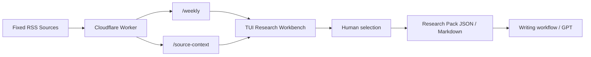
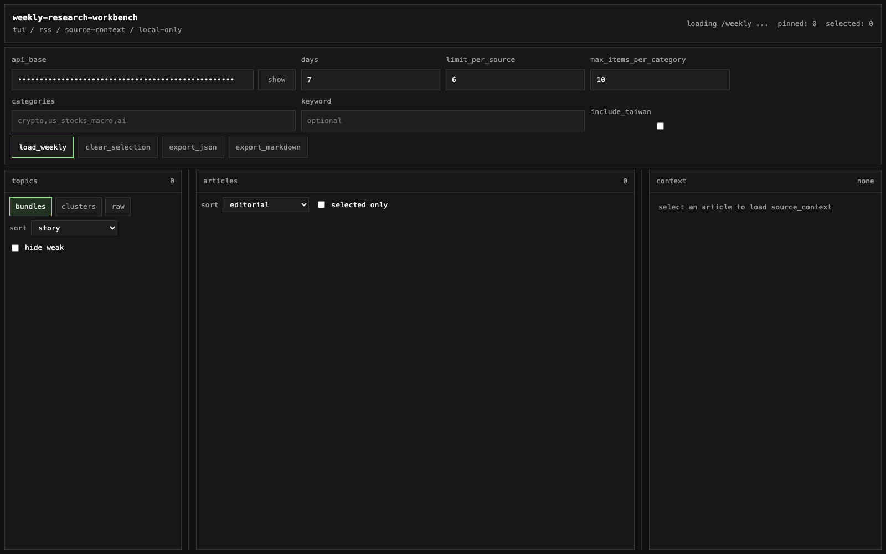

# Weekly Research Workbench

A lightweight market-research stack for weekly report workflows.

This repo contains two pieces:

1. A `Cloudflare Worker` that fetches fixed RSS sources, normalizes them, clusters them, and exposes stable JSON.
2. A `TUI-style workbench` that lets you inspect topics, open source context, pin stories, tag `core / related`, and export a research pack before writing.

The project is designed for a simple rule:

`fixed sources -> structured research -> human selection -> report writing`

It does **not** use general web search as a fallback, and it does **not** try to write weekly report copy inside the Worker itself.

## Architecture



## Workbench screenshot



## Repo structure

### `src/`

Cloudflare Worker source code.

- `index.ts`: routing and API responses
- `rss.ts`: RSS parsing and normalization
- `source-context.ts`: fetch and clean selected article pages
- `editorial.ts`: scoring and enrichment
- `signals.ts`: private enrichment adapters
- `sources.ts`: built-in RSS source registry
- `openapi.ts`: OpenAPI schema source

### `workbench/`

Static frontend research console.

- TUI-style layout
- local-only state via `localStorage`
- topic tabs: `bundles`, `clusters`, `raw`
- article selection and `core / related` tagging
- research export as JSON / Markdown

## What the Worker does

The Worker sits between fixed news feeds and downstream GPT/report workflows:

`RSS feeds -> Worker -> cleaned JSON -> workbench / GPT`

Core responsibilities:

- read only fixed RSS sources
- parse XML safely in Workers runtime
- clean HTML from descriptions
- deduplicate items by normalized URL
- preserve per-feed failure reporting
- cluster articles into themes
- expose a stable API for selection and downstream writing

The Worker intentionally does **not**:

- fall back to search engines
- scrape arbitrary websites as replacement sources
- write the final weekly report for you

## What the workbench does

The workbench is the manual selection layer on top of the Worker.

It is meant for:

- scanning candidate story bundles
- comparing cluster-level and raw fallback topics
- opening cleaned article context
- selecting the exact source set you want
- exporting a research pack before drafting

Current workbench features:

- load `/weekly`
- inspect `narrativeBundles`, `topicClusters`, and raw fallback topics
- sort by:
  - story
  - source quality
  - corroboration
  - market reaction
  - editorial score
- filter weak topics
- open `/source-context`
- mark articles as `core` or `related`
- pin topics
- add topic and article notes
- export selected research as JSON or Markdown
- adjustable 3-column layout with persistent widths

## API overview

### `GET /health`

Always public.

### `GET /sources`

Returns the built-in source registry.

If `API_KEY` is configured, callers must send:

```http
Authorization: Bearer <API_KEY>
```

### `GET /weekly`

Fetches recent items and returns:

- category article lists
- `topicClusters`
- `narrativeBundles`
- scoring fields such as:
  - `editorialScore`
  - `sourceQualityScore`
  - `corroborationScore`
  - `marketReactionScore`

Common query parameters:

- `days`
- `limitPerSource`
- `includeTaiwan`
- `categories`
- `keyword`
- `maxItemsPerCategory`

### `GET /source-context`

Fetches cleaned context for a selected article URL that already came from the feed layer.

Typical outputs include:

- `leadText`
- `articleExcerpt`
- `keyParagraphs`
- `quotedLines`
- `numbersMentioned`

## Current RSS sources

Default categories:

### `crypto`

- CoinDesk — `https://www.coindesk.com/arc/outboundfeeds/rss/?outputType=xml`
- Cointelegraph — `https://cointelegraph.com/rss`
- Decrypt — `https://decrypt.co/feed`
- The Defiant — `https://thedefiant.io/feed/`
- CFTC General Press Releases — `https://www.cftc.gov/RSS/RSSGP/rssgp.xml`

### `us_stocks_macro`

- Yahoo Finance — `https://finance.yahoo.com/news/rssindex`
- CNBC Markets — `https://www.cnbc.com/id/100003114/device/rss/rss.html`
- Federal Reserve — `https://www.federalreserve.gov/feeds/press_all.xml`
- Bank of England News — `https://www.bankofengland.co.uk/rss/news`
- Nasdaq AAPL — `https://www.nasdaq.com/feed/rssoutbound?symbol=AAPL`
- Nasdaq MSFT — `https://www.nasdaq.com/feed/rssoutbound?symbol=MSFT`
- Nasdaq GOOGL — `https://www.nasdaq.com/feed/rssoutbound?symbol=GOOGL`
- Nasdaq NVDA — `https://www.nasdaq.com/feed/rssoutbound?symbol=NVDA`
- Nasdaq INTC — `https://www.nasdaq.com/feed/rssoutbound?symbol=INTC`
- Nasdaq NOK — `https://www.nasdaq.com/feed/rssoutbound?symbol=NOK`

### `ai`

- MIT AI News — `https://news.mit.edu/topic/mitartificial-intelligence2-rss.xml`
- Hugging Face Blog — `https://huggingface.co/blog/feed.xml`
- VentureBeat AI — `https://venturebeat.com/category/ai/feed/`
- OpenAI News — `https://openai.com/news/rss.xml`
- Google AI Blog — `https://blog.google/technology/ai/rss/`
- Google DeepMind — `https://deepmind.google/blog/rss.xml`
- BAIR Blog — `https://bair.berkeley.edu/blog/feed.xml`
- iThome News — `https://www.ithome.com.tw/rss`

Optional category:

### `taiwan_stocks`

- FSC Press Releases — `https://www.fsc.gov.tw/RSS/Messages?serno=201202290016&language=english`
- TWSE News — `https://www.twse.com.tw/rwd/zh/news/feed?type=rss`
- CNA Finance — `https://feeds.feedburner.com/rsscna/finance`
- CNA Technology — `https://feeds.feedburner.com/rsscna/technology`
- MoneyDJ Finance News — `https://www.moneydj.com/kmdj/RssCenter.aspx?svc=NW&fno=1&arg=X0000000`
- DIGITIMES Daily — `https://www.digitimes.com/rss/daily.xml`
- TechNews Finance — `https://finance.technews.tw/feed/`
- Business Weekly Investment — `https://www.businessweekly.com.tw/Event/feedsec.aspx?feedid=10&channelid=15`
- Focus Taiwan Business (HTML feed parser) — `https://focustaiwan.tw/business`
- Taipei Times Business (HTML feed parser) — `https://www.taipeitimes.com/News/biz`
- TrendForce Semiconductors (HTML feed parser) — `https://www.trendforce.com/news/category/semiconductors/`
- TrendForce News — `https://www.trendforce.com/news/feed/`
- RTI Business (HTML feed parser) — `https://en.rti.org.tw/news/category/business`
- MOPS Material Information 201001 — `https://mopsov.twse.com.tw/nas/rss/mopsrss201001.xml`
- MOPS Material Information 201002 — `https://mopsov.twse.com.tw/nas/rss/mopsrss201002.xml`
- MOPS Material Information 201003 — `https://mopsov.twse.com.tw/nas/rss/mopsrss201003.xml`
- Yahoo Taiwan Stock News — `https://tw.stock.yahoo.com/rss?category=tw-market`
- Yahoo Taiwan Stock News Feed — `https://tw.stock.yahoo.com/rss?category=news`
- Yahoo Taiwan Stock Research — `https://tw.stock.yahoo.com/rss?category=research`
- Yahoo Taiwan Funds News — `https://tw.stock.yahoo.com/rss?category=funds-news`
- Cnyes Taiwan Stock News (HTML feed parser) — `https://news.cnyes.com/news/cat/tw_stock_news`
- UDN Taiwan Stock News (HTML feed parser) — `https://money.udn.com/money/cate/5594`
- UDN Taiwan Industry News (HTML feed parser) — `https://money.udn.com/money/cate/5591`
- TPEx Press Releases — `https://www.tpex.org.tw/www/zh-tw/news/list`

Taiwan feeds are only fetched when `includeTaiwan=true`.

## How the algorithm decides

This project does not use a single black-box model to decide what matters.

It uses a layered rule-based pipeline:

`article -> score -> tags/entities -> cluster -> bundle -> final category ordering`

If you want to tune the behavior, the main file is:

- [`src/editorial.ts`](./src/editorial.ts)

The final Taiwan category display mixing / de-duplication logic is in:

- [`src/index.ts`](./src/index.ts)

### 1. Article-level scoring

Each article starts as a normalized feed item, then gets enriched by `enrichWithEditorialSignals()` in `src/editorial.ts`.

The core scoring entry point is:

- `scoreBaseEditorial(item)`

This function looks at:

- source type
- source priority
- title and description text
- entity matches
- event matches
- low-signal / noisy patterns
- freshness
- category-specific boosts

It outputs:

- `score`
- `signals`
- `topicTags`
- `topicEntities`

#### Entity matching

The algorithm first looks for important entities such as:

- Big Tech names: Google / Alphabet, Microsoft, Amazon, Meta, Apple
- chip names: Nvidia, Intel, AMD
- crypto entities: Bitcoin, Ethereum, Strategy, Coinbase, stablecoins
- macro entities: Fed, CPI, jobs, GDP

These are defined in:

- `ENTITY_PATTERNS`

Each match adds:

- one or more `topicTags`
- one `topicEntity`
- an editorial score bonus

Example:

- `Google + earnings` will usually add:
  - `big_tech`
  - `earnings_watch`
  - high editorial weight

#### Event matching

The algorithm then looks for event types such as:

- earnings
- record highs
- index moves
- capex / data center / compute infrastructure
- regulation
- fund flows
- price moves
- launch / rollout

These are defined in:

- `EVENT_PATTERNS`

Each event can:

- add score
- add tags
- add an `event:*` signal

#### Penalties

The system also subtracts score for low-value or noisy items, defined in:

- `LOW_SIGNAL_PATTERNS`

Typical penalties include:

- how-to / tutorial content
- brand marketing fluff
- generic daily recaps
- admin notices
- clickbait investing headlines
- generic active-stock lists

For Taiwan specifically, ETF administrative notices are also penalized.  
This is how the system avoids over-promoting things like:

- ETF listing notices
- financing / securities lending setup notices
- educational ETF pages

#### Category-specific boosts

After generic scoring, the article gets category-specific boosts:

- `us_stocks_macro`
  - earnings / index move / macro data are boosted
- `ai`
  - AI infra / capex / compute themes are boosted
- `crypto`
  - policy / flows / Strategy / ETF structure themes are boosted
- `taiwan_stocks`
  - Taiwan supply-chain, semis, ETF flows, policy, data center, market-story tags are added and weighted separately

Taiwan-specific logic is important enough that it has its own source families and content checks.

Key Taiwan helpers include:

- `isTaiwanSupplyChainStory()`
- `isTaiwanAdministrativeFundNotice()`
- `isTaiwanEnglishMarketStory()`
- `isTaiwanBroadMarketStory()`

### 2. Derived metadata

Once the base score exists, the algorithm derives several fields that later drive clustering:

- `topicTags`
- `topicEntities`
- `eventType`
- `majorEntity`
- `marketTheme`
- `clusterKey`

These are important because the later grouping logic does **not** compare articles purely by text similarity.

Instead, it compares structured fields like:

- shared entities
- shared tags
- shared market theme
- shared event type

#### What these fields mean

- `topicTags`
  - semantic tags like `earnings`, `fund_flows`, `ai_infra`, `taiwan_ai_supply_chain`
- `topicEntities`
  - extracted entities like `alphabet`, `strategy`, `nvidia`
- `eventType`
  - the main event class, such as `earnings`, `fund_flows`, `policy`, `macro_data`
- `majorEntity`
  - the main company / asset / macro anchor
- `marketTheme`
  - the broad market frame, such as `official`, `flows`, `market`
- `clusterKey`
  - the deterministic key used to group similar articles into one topic cluster

If you want different article grouping behavior, `clusterKey` generation is one of the most important places to inspect.

### 3. Source quality, corroboration, and market reaction

After article enrichment, three additional scores are calculated:

- `sourceQualityScore`
- `corroborationScore`
- `marketReactionScore`

#### `sourceQualityScore`

Main function:

- `scoreSourceQuality(...)`

This score is based on:

- `sourceType`
  - official / research / media
- source priority
- whether the article contains meaningful numbers
- whether the article contains quotes
- whether the article is tied to high-value entities

Taiwan has extra source-weighting families:

- `TAIWAN_LOCAL_HARD_SOURCE_SET`
- `TAIWAN_LOCAL_STORY_SOURCE_SET`
- `TAIWAN_INDUSTRY_CONTEXT_SOURCE_SET`
- `TAIWAN_EN_MARKET_CORE_SOURCE_SET`
- `TAIWAN_EN_MARKET_CONTEXT_SOURCE_SET`
- `TAIWAN_EN_SUPPLY_CHAIN_SOURCE_SET`

This is how the system distinguishes:

- official Taiwan disclosure
- local Taiwan market reporting
- Taiwan industry / supply-chain context
- English Taiwan market coverage

#### `corroborationScore`

This score tries to answer:

`How well is this article corroborated by other evidence?`

It uses:

- overlap with matched editorial topics
- overlap in tags and entities
- source diversity
- source context around the same theme

This is why a single strong official item can still be useful, but multiple cross-source items usually rank better.

#### `marketReactionScore`

This score tries to answer:

`Did the market actually react to this?`

It looks for things like:

- explicit percentage moves
- shares rising / falling
- record highs
- flows / inflows / outflows
- price-action language in the title

This score helps separate:

- important but static background pieces
- from things the market is actively repricing

### 4. `raw`, `clusters`, and `bundles`

The workbench has three layers because the algorithm groups information in stages.

#### `raw`

`raw` is the fallback view of individual story candidates.

Use it when:

- clustering did not find enough matching articles
- the story is too new
- the story is niche

#### `clusters`

Main function:

- `buildTopicClusters(items)`

A `cluster` is a small event-level group:

- same event
- same entity
- same market theme
- or same structural cluster key

The algorithm groups articles by:

- `clusterKey`

Then aggregates:

- item count
- source count
- total editorial score
- average editorial score
- top titles
- tags
- entities

Current filtering logic is roughly:

- if the cluster key ends with `|general`
  - require `averageEditorialScore >= 85`
  - and `itemCount >= 2`
- otherwise
  - require either:
    - `totalEditorialScore >= 90`
    - or `itemCount >= 2`

That means some clusters can still have only one article if:

- the article scored high enough
- and the system thinks it is worth surfacing as a candidate

This is especially true for Taiwan because the thresholds were intentionally loosened so the Taiwan view would not collapse into an empty screen.

#### `bundles`

Main function:

- `buildNarrativeBundles(clusters)`

A `bundle` is a story package suitable for a weekly report.

It is **not** just a larger cluster.  
It is a group of clusters that can be told as one story.

Examples:

- Big Tech earnings and repricing
- crypto flows and regulation
- Taiwan AI supply chain and data-center beneficiaries
- Taiwan ETF and fund-flow rotation

### 5. How bundles are formed

Bundle construction happens in two ways:

#### A. Explicit Taiwan bundle families

Taiwan is special-cased, because otherwise ETF notices, policy disclosures, market summaries, and AI supply-chain stories can easily contaminate each other.

The current explicit Taiwan families are:

- `台股 AI 供應鏈與資料中心受惠包`
- `台股 ETF 與資金輪動包`
- `台股市場與總經觀察包`
- `台股政策與公告主線包`

These are created using explicit predicates over `topicTags`, such as:

- `taiwan_ai_supply_chain`
- `taiwan_data_center`
- `taiwan_semis`
- `taiwan_etf_flows`
- `taiwan_market_story`
- `taiwan_policy`
- `taiwan_admin_notice`

This is why Taiwan bundles are more hand-shaped than generic US / AI / crypto bundles.

#### B. Generic relation-based bundling

For everything else, the algorithm compares clusters using:

- `scoreClusterRelation(a, b)`
- `canJoinBundle(anchor, candidate)`

##### `scoreClusterRelation(...)`

This adds relation points for:

- shared entities
- shared tags
- same market theme
- same event type
- same category
- overlapping title tokens

It also has explicit bridge bonuses for cross-market narratives:

- Big Tech + AI bridge
- crypto + macro bridge
- crypto + AI bridge
- Taiwan story bridge

##### `canJoinBundle(...)`

This is the guardrail function.

It stops clusters from being merged just because they happen to have high scores.

Important examples:

- Taiwan AI clusters do not freely merge with Taiwan ETF clusters
- Taiwan market / macro clusters do not freely merge with Taiwan AI clusters unless they share enough real overlap
- Taiwan policy / admin notices do not freely merge into Taiwan AI
- non-Taiwan clusters are not allowed to become Taiwan bundles unless they really carry Taiwan tags

If you think the system is mixing the wrong stories together, this is one of the first functions to edit.

### 6. Standalone bundles

Main function:

- `canFormStandaloneBundle(cluster)`

Normally a bundle should contain multiple clusters.

But in Taiwan, some strong clusters are allowed to become standalone bundles if they are strong enough.

Current logic requires:

- category = `taiwan_stocks`
- not tagged as `taiwan_admin_notice`
- `totalEditorialScore >= 90`
- and at least one strong Taiwan tag, such as:
  - `taiwan_ai_supply_chain`
  - `taiwan_semis`
  - `taiwan_etf_flows`
  - `taiwan_policy`
  - `taiwan_data_center`
  - `taiwan_market_story`

This is what allows one strong Taiwan story to still appear as a report candidate.

### 7. Final Taiwan front-page diversification

Even after scoring and bundling, Taiwan stories can still be dominated by:

- one aggressive source
- one ETF-heavy source family
- one announcement-heavy family

So there is one more step in:

- `src/index.ts`
- `diversifyTaiwanItems(items, limit)`

This function spreads the final Taiwan item list across family buckets:

- `ai`
- `etf`
- `market`
- `policy`
- `semis`
- `other`

It also uses multi-pass source caps and family caps, so the final visible list is not washed out by one source or one story family.

This is a display-stage diversification step, not the core cluster/bundle logic.

If you feel Taiwan is:

- too repetitive
- too ETF-heavy
- too official-notice-heavy

this is one of the main places to adjust.

### 8. What to edit if you want different behavior

#### If you want to change article importance

Edit:

- `ENTITY_PATTERNS`
- `EVENT_PATTERNS`
- `LOW_SIGNAL_PATTERNS`
- `scoreBaseEditorial()`

#### If you want to change source weighting

Edit:

- `scoreSourceQuality()`
- Taiwan source sets such as:
  - `TAIWAN_LOCAL_HARD_SOURCE_SET`
  - `TAIWAN_LOCAL_STORY_SOURCE_SET`
  - `TAIWAN_INDUSTRY_CONTEXT_SOURCE_SET`
  - `TAIWAN_EN_MARKET_CORE_SOURCE_SET`
  - `TAIWAN_EN_MARKET_CONTEXT_SOURCE_SET`
  - `TAIWAN_EN_SUPPLY_CHAIN_SOURCE_SET`

#### If you want to change article grouping

Edit:

- `deriveEventType()`
- `deriveMarketTheme()`
- `buildClusterKey()`
- `buildTopicClusters()`

#### If you want to change bundle composition

Edit:

- `buildNarrativeBundles()`
- `scoreClusterRelation()`
- `canJoinBundle()`
- `canFormStandaloneBundle()`

#### If you want to change Taiwan front-page diversity

Edit:

- `diversifyTaiwanItems()` in `src/index.ts`

### 9. The practical goal

The algorithm is not trying to show you the most articles.

It is trying to turn:

- fixed sources
- mixed article quality
- uneven category density

into:

- `raw` materials
- event-level `clusters`
- report-ready `bundles`

so the workbench becomes:

`source collection -> story compression -> human editorial selection`

## `scoring_v2` design draft

The current system already has:

- `editorialScore`
- `sourceQualityScore`
- `corroborationScore`
- `marketReactionScore`

But for future tuning, a better design is to split article quality into more explicit dimensions instead of relying too heavily on one aggregated score.

This section is a proposed next-step design, not yet the live production formula.

### Why split the score

Right now, several different ideas are partially mixed together:

- source trust
- evidence density
- how well claims are supported
- cross-source confirmation
- market reaction
- story usefulness

If these are separated, the system becomes:

- easier to debug
- easier to tune
- easier to learn from editor behavior later

### Proposed score families

#### 1. `SourceScore`

Question:

`How trustworthy is the source itself?`

Inputs:

- source type
- source priority
- whether the source is primary / official
- whether the source has historically acted like:
  - hard disclosure
  - local market reporting
  - industry context
  - English Taiwan market context

Suggested structure:

```text
SourceScore = sourceTypeScore + primarySourceBonus + sourceHistoryBonus
```

Typical interpretation:

- official / primary disclosure -> very high
- research / strong local market reporting -> high
- industry context / supply-chain media -> medium-high
- generic aggregator -> low

#### 2. `EvidenceScore`

Question:

`How much directly usable evidence is present in the article itself?`

Inputs:

- `numberCount`
- `quoteCount`
- `paragraphCount`
- whether there is a primary document or primary statement behind the article

Suggested structure:

```text
EvidenceScore = numbersScore + quotesScore + paragraphScore + primaryDocBonus
```

This score should answer:

- does the article actually contain usable numbers?
- does it contain quotable material?
- does it contain enough body content to support a report?

#### 3. `SubstantiationScore`

Question:

`Do the claims in the title / lead actually have support in the body?`

This is different from `EvidenceScore`.

- `EvidenceScore` asks: is there evidence?
- `SubstantiationScore` asks: does the evidence actually support the main claim?

Suggested signals:

- title claim appears again in key paragraphs
- title numbers are supported by body numbers
- the article is not just making a broad conclusion without support
- quotes are relevant to the main claim, not filler

First version can be coarse:

- `high`
- `medium`
- `low`

#### 4. `CorroborationScore`

Question:

`How well is this story confirmed across multiple sources?`

Inputs:

- article count
- source count
- source-type diversity
- whether there is an official source
- whether there is cross-market reinforcement

Suggested interpretation:

- one article, one source -> low
- multiple articles, multiple sources -> medium
- official + media + industry confirmation -> high

#### 5. `MarketReactionScore`

Question:

`Did the market actually react to this information?`

Inputs:

- explicit percentage moves
- price-action language
- record highs / large drops
- ETF inflows / outflows
- index or sector reaction

This score should stay separate from pure quality because:

- a high-quality article can have low immediate reaction
- a low-quality article can still describe a very strong market move

#### 6. `StoryValueScore`

Question:

`How useful is this item for building a reportable story?`

Inputs:

- can it form or support a cluster?
- can it join a bundle?
- is it a core event or only background?
- does it connect to a larger market narrative?

Suggested interpretation:

- raw-only material -> low
- singleton cluster -> medium
- multi-article cluster -> high
- bundle core -> very high

### Proposed total score

One simple weighted version:

```text
TotalScore
= 0.22 * SourceScore
+ 0.20 * EvidenceScore
+ 0.15 * SubstantiationScore
+ 0.18 * CorroborationScore
+ 0.15 * MarketReactionScore
+ 0.10 * StoryValueScore
- Penalties
```

This should not be treated as final.  
It is a clean starting point because it is:

- interpretable
- easy to compare
- easy to tune by category

### Penalties should stay separate

Do not hide penalties inside the main positive scores.

Keep a separate penalty layer for:

- how-to / tutorial content
- brand fluff
- generic roundups
- low-information admin notices
- title-body mismatch
- dead-link or feed-only fallback articles

This makes debugging easier:

- high evidence but heavy penalty
- high source quality but weak story value

These should be visible as distinct cases.

### What should be stored now for future learning

To support future ranking models, the system should preserve:

#### Article-level features

- `sourceName`
- `sourceType`
- `sourcePriority`
- `numberCount`
- `quoteCount`
- `paragraphCount`
- `hasPrimarySource`
- `hasOfficialSource`
- `isFeedFallback`
- `topicTags`
- `topicEntities`
- `editorialSignals`
- `sourceQualityScore`
- `corroborationScore`
- `marketReactionScore`
- future: `EvidenceScore`
- future: `SubstantiationScore`

#### Topic / cluster-level features

- `articleCount`
- `sourceCount`
- `sourceTypeDiversity`
- `officialBackedCount`
- `strongEvidenceCount`
- `bundleFamily`
- `isBundle`
- `isStandaloneBundle`

#### Editor behavior labels

- `pinned`
- `selected`
- `selectedAsCore`
- `selectedAsRelated`
- `exported`
- future: `usedInFinalReport`

These editor actions are especially important because they can later become training labels.

### Future ranking model direction

The best long-term path is probably not a fully black-box model.

A more practical path is:

#### Stage 1

Rule-based scoring with explicit dimensions:

- `SourceScore`
- `EvidenceScore`
- `SubstantiationScore`
- `CorroborationScore`
- `MarketReactionScore`
- `StoryValueScore`

#### Stage 2

Learn from editor behavior using ranking models such as:

- `LightGBM ranker`
- `XGBoost ranker`

Useful supervision signals:

- item A was selected, item B was not
- item A became `core`, item B stayed `related`
- item A was pinned and exported, item B was ignored

This is better than pretending there is a single absolute “quality” label.

### Practical implementation order

If this system is upgraded later, the best order is:

1. split the current score into explicit sub-scores
2. add `SubstantiationScore`
3. store editor interaction labels
4. learn ranking preferences from real usage

In practice, this means:

`better explainability first, learned ranking second`

## Private enrichment

The Worker can optionally enrich RSS topics with private signals inspired by `boba-cli`.

Supported adapters currently include:

- BlockBeats
- OpenNews
- selected Twitter / X KOL feeds

These are used for:

- cross-source confirmation
- social proof proxy
- better clustering
- stronger editorial ranking

### Required secrets

Set any or all of the following:

```bash
wrangler secret put BLOCKBEATS_API_KEY
wrangler secret put OPENNEWS_TOKEN
wrangler secret put TWITTER_TOKEN
```

If a secret is missing, that source is skipped.

### KV setup

Create a KV namespace:

```bash
wrangler kv namespace create EDITORIAL_CACHE
wrangler kv namespace create EDITORIAL_CACHE --preview
```

Then add the returned IDs to `wrangler.toml`.

### Cron

The Worker uses an hourly Cron trigger:

```toml
[triggers]
crons = ["0 * * * *"]
```

## Authentication

`/health` is always public.

`/sources` and `/weekly` are conditionally protected:

- if `API_KEY` is unset, they are public
- if `API_KEY` is set, they require bearer auth

Set the secret:

```bash
wrangler secret put API_KEY
```

For local development:

```text
API_KEY=your-token
```

## Install

```bash
npm install
```

## Local development

### Run the Worker

```bash
npm run dev
```

Wrangler will expose a local address, typically:

```text
http://127.0.0.1:8787
```

Quick checks:

```bash
curl http://127.0.0.1:8787/health
curl http://127.0.0.1:8787/sources
curl "http://127.0.0.1:8787/weekly?days=7"
curl "http://127.0.0.1:8787/weekly?days=7&includeTaiwan=true"
```

### Run the workbench locally

```bash
cd workbench
python3 -m http.server 4173
```

Then open:

```text
http://127.0.0.1:4173
```

Set `api_base` in the UI to your current Worker domain or local Worker address.

## Deploy

### Deploy the Worker

```bash
npm install
npm run deploy
```

### Deploy the workbench to Cloudflare Pages

From `workbench/`:

```bash
npx wrangler pages project create weekly-research-workbench --production-branch=main
npx wrangler pages deploy . --project-name weekly-research-workbench
```

## OpenAPI

The repo includes:

- `openapi.yaml`
- `src/openapi.ts`

You can use either the checked-in schema file or the deployed Worker schema endpoint for downstream integrations.

## Failure handling

If a single RSS feed fails:

- the API still returns `ok: true`
- that source appears in `failedFeeds`
- other feeds still return normally

If every feed fails:

- the API still returns `ok: true`
- `summary.totalItems` becomes `0`
- `failedFeeds` contains all failed sources

If private enrichment fails:

- `/weekly` still returns RSS-backed results
- scoring falls back to RSS-only logic
- the API remains usable

## Notes

- This repo is designed for fixed-source research, not open-ended search.
- The workbench is intentionally local-state-first and cheap to run.
- If you later want a richer system, the natural next steps are:
  - persistent workspace storage
  - merge / split topic operations
  - handoff into a writing-stage app or OpenAI API workflow
